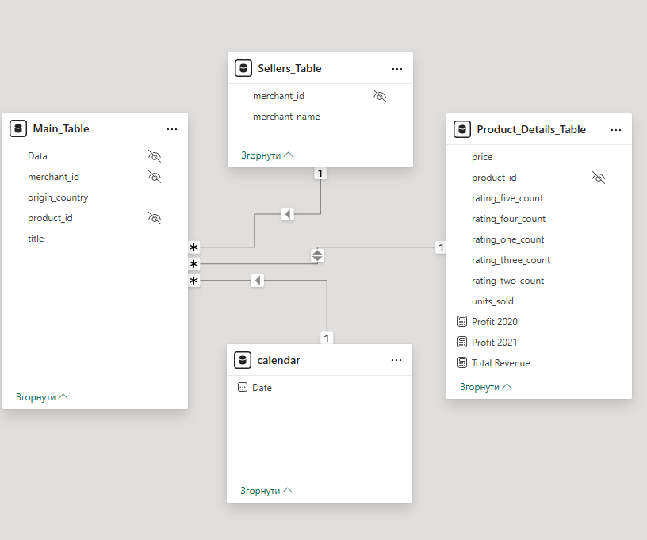
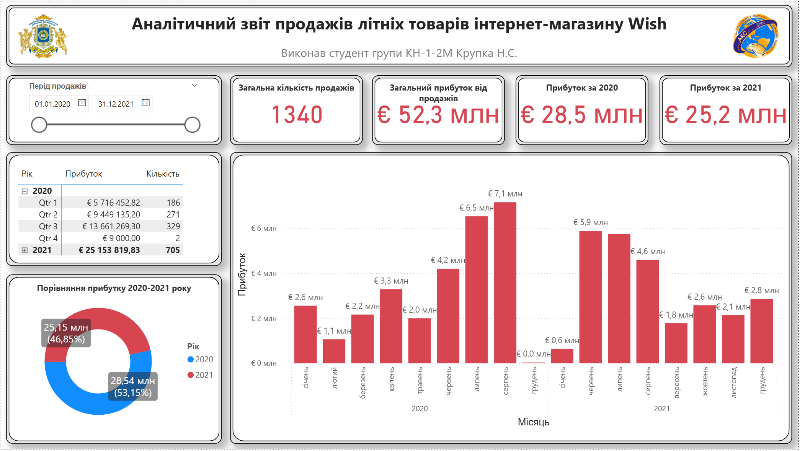
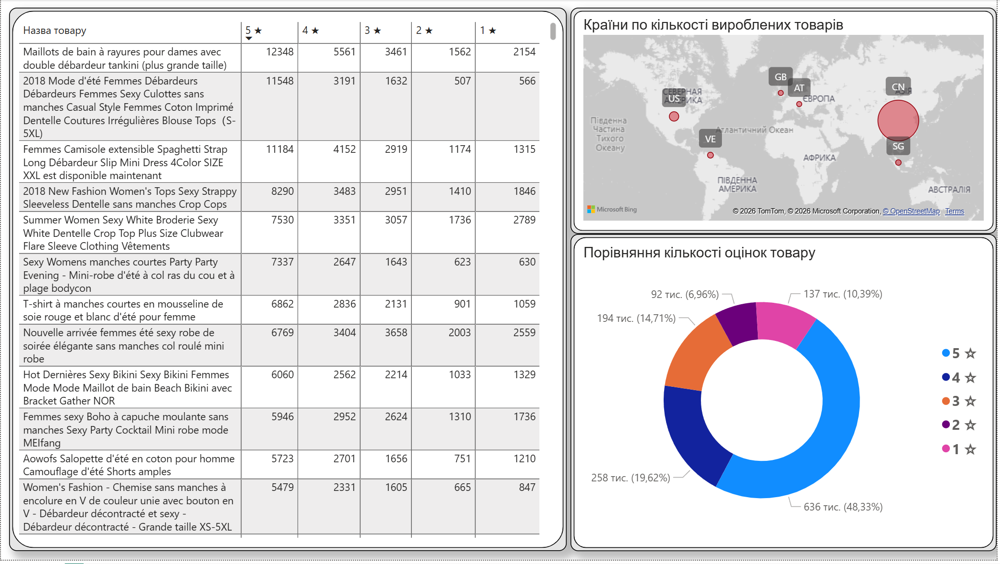
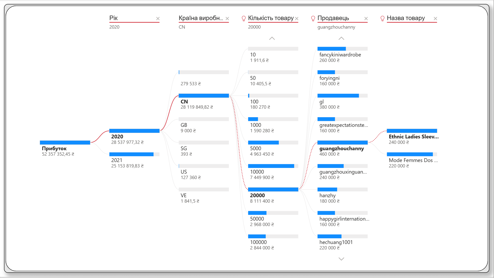

# Аналіз продажів літніх товарів інтернет-магазину Wish

Інтерактивний аналітичний дашборд, розроблений у Power BI для візуалізації та аналізу статистики продажів літніх товарів інтернет-магазину Wish.

## Про проект

Курсова робота з дисципліни «Аналітика великих даних».  
Спеціальність: 122 «Комп’ютерні науки»  
Національний університет харчових технологій (НУХТ), Київ, 2024

**Тема роботи:** Збір відкритої інформації та побудова аналітичного звіту за темою «Аналіз даних статистики продажів літніх товарів інтернет-магазину Wish».

## Мета проекту

Розробка інтерактивного аналітичного звіту для дослідження динаміки продажів, сезонних тенденцій, географічного розподілу виробників, рейтингу товарів та фінансових показників.

## Використані технології

- Microsoft Power BI Desktop
- Power Query (очищення та трансформація даних)
- DAX (розрахункові міри та показники)

## Модель даних

Проект використовує зіркоподібну модель даних, що складається з чотирьох таблиць:

- **Main_Table** — центральна таблиця фактів
- **Product_Details_Table** — детальна інформація про товари
- **Sellers_Table** — інформація про продавців
- **Calendar** — календарна таблиця для часового аналізу

## Структура дашборду

Дашборд складається з трьох основних сторінок:

1. **Загальні відомості** — ключові показники ефективності (KPI), порівняння прибутку за роками, динаміка продажів по місяцях і кварталах.
2. **Деталі** — аналіз товарів, розподіл оцінок клієнтів (1–5 зірок), географічний розподіл виробників.
3. **Дерево декомпозицій** — багаторівневий drill-down аналіз прибутку за роком, країною-виробником, продавцем та товаром.

## Візуалізація дашборду

**Головна сторінка (Загальні відомості)**

**Сторінка «Деталі»**

**Сторінка «Дерево декомпозицій»**

## Структура репозиторію

- `reports/` — файл аналітичного звіту Power BI (`Wish_Summer_Sales_Dashboard.pbix`)
- `data/` — очищені набори даних у форматі CSV
- `screenshots/` — знімки екрану основних сторінок дашборду та моделі даних
- `KP_KH_1_2M_Krupka_NS.docx` — текст курсової роботи

## Джерело даних

Датасет: Summer Products and Sales in E-commerce Wish  
Kaggle: https://www.kaggle.com/datasets/jmmvutu/summer-products-and-sales-in-ecommerce-wish

## Автор

**Крупка Назар Сергійович**  
Студент магістратури  
Спеціальність 122 «Комп’ютерні науки»  
Національний університет харчових технологій (НУХТ)

---

Розроблено в рамках вивчення методів аналізу великих даних та візуалізації в Power BI.
